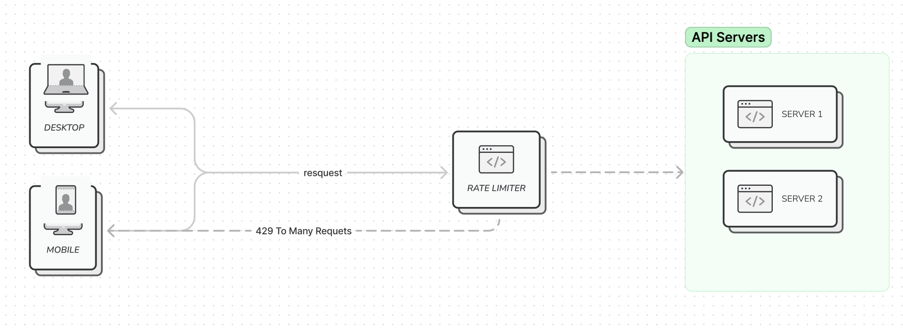

# Learn Rate Limiter

Rate Limiter can used for a few purposes such as:
 - To control the rate of traffic in a Network System. This requests can be sent by a client or a service.
 - To limits the number os requests allowed to be processed over a specified period of time in a HTTP Server.

## Rate Limiter Diagram

## Algorithms for Rate Limiting
- Token Bucket
- Leaking Bucket 
- Fixed Window Counter
- Sliding Window Log
- Sliding Window Counter